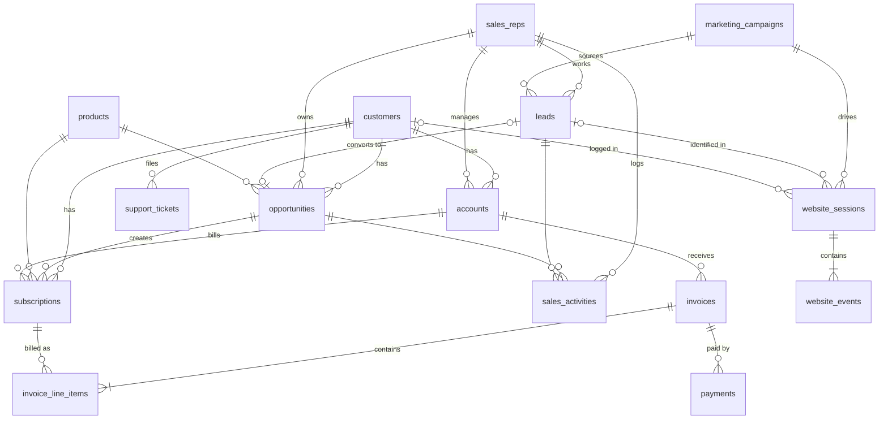

# NovaFlow: synthetic B2B SaaS dataset (Phase 1: raw data)

**NovaFlow** is a fictional B2B SaaS analytics platform: seat-based Starter / Professional /
Enterprise plans, add-ons (AI Insights, Embedded Analytics, Reverse ETL...) and professional services,
sold by a four-region sales org to SMB, Mid-Market and Enterprise companies.

This package generates a Salesforce + marketing + product-billing + support ecosystem with Python,
NumPy and Faker. Every table comes out of **one simulated customer lifecycle**, so foreign keys join,
timestamps are ordered correctly, and the metrics show real business patterns.

Data covers **2022-01-01 → 2026-06-30** (the snapshot date).

## Quick start

```bash
pip install -r data_generator/requirements.txt
python data_generator/generate.py                 # full size, ~2 min, ~480 MB of CSV in data/raw/
python data_generator/generate.py --scale 0.05    # 5% sample in a few seconds
python data_generator/generate.py --format parquet --out data/raw_parquet
python data_generator/generate.py --clean         # skip the injected data-quality issues
python data_generator/validate.py                 # PK / FK / temporal checks + KPI snapshot
```

Output is deterministic for a given `--seed` (default 42). `data/` is git-ignored. Regenerate it
instead of committing it.

## Tables (full scale, seed 42)

| Table | Rows | Grain |
|---|---:|---|
| `customers` | 100,000 | One company NovaFlow's CRM knows about (prospect, customer or churned) |
| `accounts` | ~54k | Product / billing account (Production, Sandbox, Business Unit, Trial) |
| `leads` | ~254k | Marketing / SDR lead (person at a company) |
| `opportunities` | ~303k | New Business, Expansion and Renewal deals |
| `sales_reps` | 250 | Sales org: VP → regional directors → managers → SDR / AE / AM |
| `products` | 12 | Platform tiers, add-ons, services |
| `subscriptions` | ~75k | Subscription line (product × account), with MRR / ARR |
| `marketing_campaigns` | 600 | Campaigns by channel with budget and actual cost |
| `website_sessions` | ~400k | Web session with UTM / channel attribution |
| `website_events` | ~1.02M | Clickstream events (page views, CTAs, form submits, logins...) |
| `sales_activities` | ~500k | Calls, emails, meetings, demos on leads and opportunities |
| `invoices` | ~226k | Invoice header (one per account per billing date) |
| `invoice_line_items` | ~261k | Invoice lines per subscription period or one-time charge |
| `payments` | ~226k | Payment transactions: charges, failed card retries, installments, refunds |
| `support_tickets` | ~50k | Support cases with SLA and CSAT |

IDs are readable prefixed strings (`CUS-000001`, `OPP-0000001`, `SES-...`).

## Entity relationships



Key joins worth knowing:
- `leads.converted_opportunity_id` / `opportunities.lead_id` link the marketing funnel to the pipeline.
  `opportunities.campaign_id` is the converted lead's campaign (primary campaign source).
- Unconverted leads have no `customer_id`. Match them to `customers` by `company_domain = domain`
  (about a third belong to companies already in the CRM).
- `website_sessions.anonymous_id` stays the same across a visitor's sessions. Research visits before
  a lead form are anonymous (`lead_id` null) and can be stitched to the lead via `anonymous_id`.
- Invoice amounts are in the account's billing currency (`currency`, `fx_rate_to_usd`). `*_usd`
  columns are already converted.

## How the simulation works

For each customer, `novaflow/lifecycle.py` steps through time:

1. **New Business**: an AE (employed on that date, in the right region/segment) works a deal. Win
   probability = segment base rate × industry × lead source × customer fit × rep skill. Lost deals are
   often re-engaged months later (up to 8 attempts).
2. **Win** → a Production account, a platform subscription, optional onboarding services, and for
   larger customers Sandbox / Business Unit accounts.
3. **Expansions** (seat upsells, add-ons limited to products launched by then, services) arrive at
   a rate driven by segment and customer health. They are co-termed with the platform contract.
4. **Renewals** at each 12/24/36-month term end, or monthly churn for month-to-month SMB customers.
   Retention depends on a hidden health score.
5. Leads, web traffic, activities, tickets and billing are then derived from those events.

### Patterns you can find

- **Growth**: customers, leads and campaigns grow over time; campaign budgets grow ~25% per year.
- **Seasonality**: fewer weekend events; won deals bunch at **quarter end** with **deeper discounts**.
- **Segments**: SMB closes fast (~25-day cycle, ~23% NB win rate); Enterprise is slow (~110 days,
  ~15%) but brings big multi-year deals, more tickets and more Urgent priorities.
- **Channels**: Customer Referral and Partner leads win far more often than Outbound or Paid Social.
- **Rep performance**: every rep has a hidden skill multiplier, so win rates differ by rep. Reps are
  hired and leave over time (`hire_date` / `termination_date`).
- **Churn signals**: unhealthy customers file more tickets, give lower CSAT, pay late and fail card
  payments more often, win fewer expansions, and churn. `accounts.health_score` is a noisy
  observable proxy for this.
- **Product launches**: AI Insights (2023-06) and Real-time Streaming (2024-03) only sell after launch.
- **Billing realism**: prorated co-termed add-ons, Net 30/45/60 terms, card retries (3/5/7 days),
  Enterprise installment payments, partial refunds, uncollectible invoices, processor fees.

Headline numbers at the snapshot (full scale): ~30.5k paying customers, ~$740M active ARR,
~20% lead→opportunity conversion, ~15% website session conversion.

## Injected data-quality issues

These give the dbt staging layer real cleaning work. Turn them off with `--clean`.

| Table | Issue |
|---|---|
| `customers` | ~2% `industry` values lower-cased or padded with spaces; ~1% null `country` |
| `leads` | ~1.5% duplicate submissions (same person, new `lead_id`, later `created_at`, status `New`); ~3% upper-case emails; ~1% null emails; ~1% `lead_source` as `paid_search`-style labels |
| `opportunities` | ~5% of open deals have null `amount_usd` (not yet priced) |
| `website_sessions` | Some `United States` values written as `US` / `USA` / `united states` |
| `website_events` | ~0.4% exact duplicate rows (tracker double-fire, same `event_id`) |
| `support_tickets` | ~1% `priority` values upper-cased |

## Tuning

All assumptions live in `novaflow/config.py`: date range, row targets, segment economics (win rates,
cycle lengths, seats, discounts, expansion / ticket rates), lead-source mix and win multipliers,
regions and currencies, campaign channels. `--scale` multiplies the row targets. Opportunities,
subscriptions and billing grow with the customer count.

## Layout

```
data_generator/
├── generate.py          # CLI entry point
├── validate.py          # integrity checks + KPI snapshot
└── novaflow/
    ├── config.py        # every tunable assumption
    ├── utils.py         # date math, seasonal sampling
    ├── reference.py     # sales reps, products, campaigns
    ├── customers.py     # company master
    ├── lifecycle.py     # opportunities, accounts, subscriptions (core simulation)
    ├── leads.py         # leads + campaign attribution
    ├── web.py           # sessions + clickstream events
    ├── activities.py    # sales activities
    ├── support.py       # support tickets
    ├── billing.py       # invoices, invoice lines, payments
    ├── quality.py       # injected data-quality issues
    └── pipeline.py      # orchestration + writers
```
